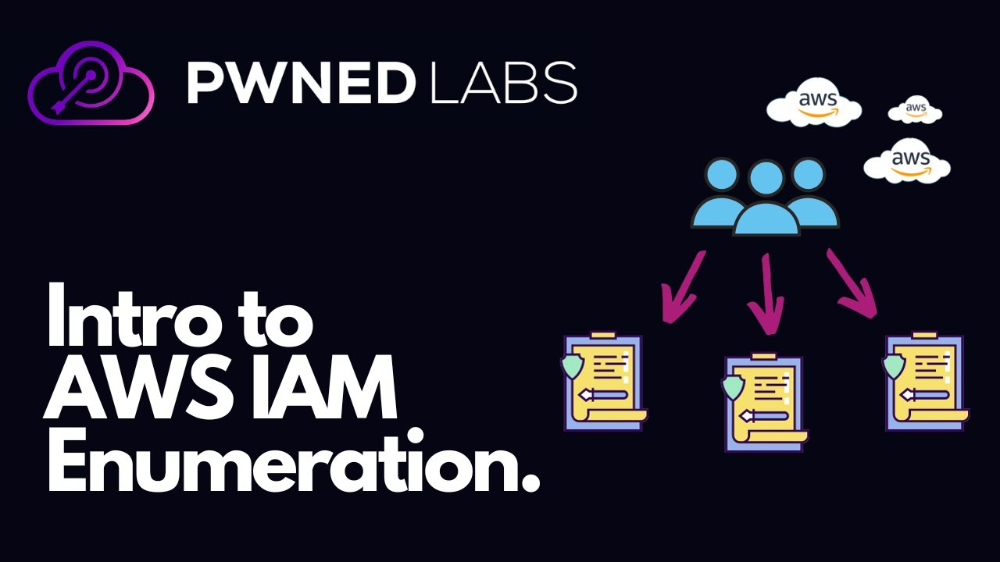

# Intro to AWS IAM Enumeration [Pwned Labs](https://pwnedlabs.io/)
 

## Overview:
This lab focused on evaluating the IAM security posture of Huge Logistics by enumerating AWS IAM users, policies, roles, Secrets Manager permissions, and S3 bucket access. Using the provided AWS credentials, enumeration was conducted to identify accessible resources, attached policies, role assumption permissions, and privilege escalation opportunities.

Through careful IAM policy enumeration and role analysis, additional permissions were discovered that allowed access to AWS Secrets Manager as well as an S3 bucket containing the target flag file.

The lab demonstrates how overly permissive IAM configurations and improperly scoped permissions can lead to privilege escalation and exposure of sensitive resources within AWS environments.
 

## Skills Demonstarted:
- AWS IAM Enumeration
- IAM Policy Analysis
- AWS CLI Usage
- Role Assumption via STS
- AWS Secrets Manager Enumeration
- S3 Bucket Enumeration
 

## Key Techniques
- Role Assumption
- IAM Policy Analysis
 

## Tools Used
- AWS CLI
 

## Detection Opportunities
- Monitor unusual sts:AssumeRole activity through CloudTrail
- Detect excessive IAM enumeration commands from a single IAM principal in CloudTrail
- CloudWatch alerts on Secrets Manager, IAM and S3 access from unexpected users or roles based on CloudTrail events
 

## Mitigation
- Enforce the principle of least privilege across IAM users and roles
- Remove unnecessary sts:AssumeRole permissions
- Remove outdated or unused policy versions
- Implement IAM Access Analyzer to identify overly permissive access
 

## Lesson Learned
- Thorough IAM enumeration is extremely important in AWS environments
- Managed policy versions may expose legacy or unintended permissions
- Enumeration should be methodical and continuous throughout an engagement
 

## References
- [Pwned Labs Official Lab](https://pwnedlabs.io/labs/intro-to-aws-iam-enumeration)
- [AWS IAM Documentation](https://docs.aws.amazon.com/iam/)
- [AWS CLI Documentation](https://docs.aws.amazon.com/cli/)
- [AWS STS Documentation](https://docs.aws.amazon.com/STS/latest/APIReference/welcome.html)
- [IAM Policy Versioning](https://docs.aws.amazon.com/IAM/latest/UserGuide/access_policies_managed-versioning.html)
- [AWS S3 Documentation](https://docs.aws.amazon.com/s3/)
 

## Detailed Write-up
[Detailed Walkthrough](./Write-up.md)
